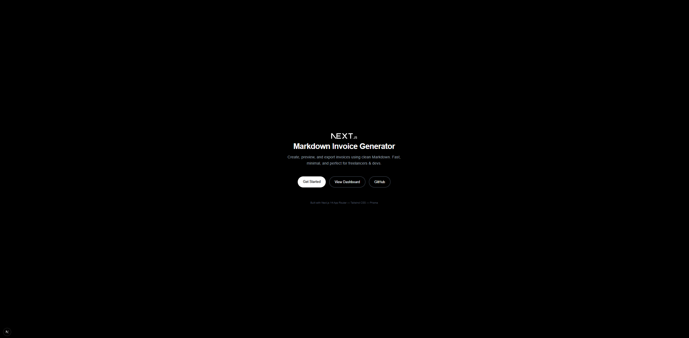
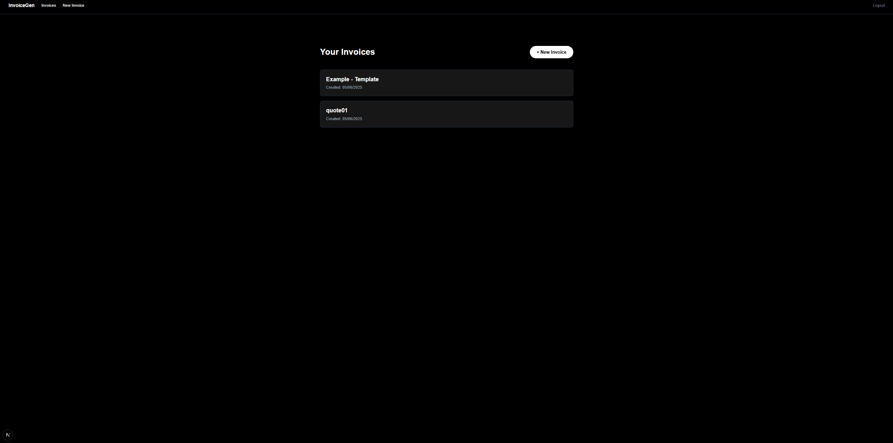
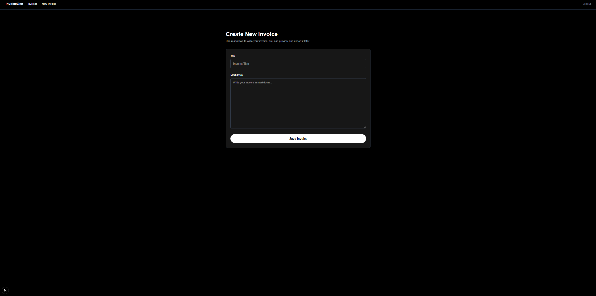
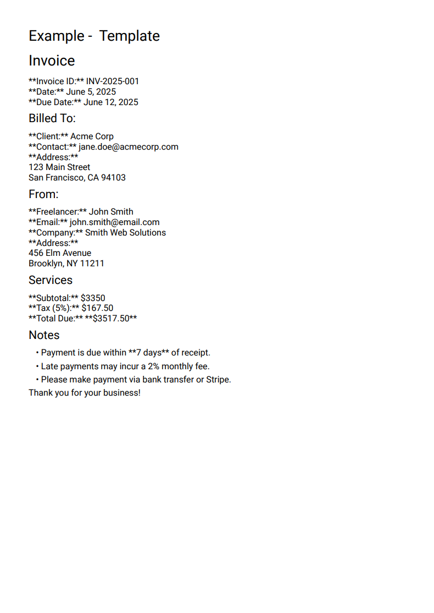

# 🧾 Invoice Markdown SaaS

A modern, Markdown-powered invoicing SaaS built with **Next.js 14**, **React**, **Tailwind CSS**, **Prisma**, and **NextAuth**. Create, preview, and export beautiful invoices as PDFs — all with markdown.



---

## ✨ Features

- 🔐 **Authentication** via email/password using NextAuth
- 📄 **Markdown Invoice Editor** with live preview
- 📦 **PDF Export** using `@react-pdf/renderer`
- 🧠 **Server-Side Rendering** with secure access control
- 🗃️ **Prisma ORM** with MySQL
- 🧭 **App Router** with layouts, loading states, and dynamic routes
- 🎨 Fully styled with **Tailwind CSS**
- 🧱 Clean, modular architecture (lib, components, routes)

---

## 🚀 Tech Stack

| Stack      | Tool                            |
|------------|----------------------------------|
| Frontend   | Next.js 14 (App Router, RSC)     |
| Styling    | Tailwind CSS                     |
| Auth       | NextAuth.js (Credentials)        |
| Database   | Prisma + MySQL       |
| Markdown   | React Markdown + Remark GFM      |
| PDF        | @react-pdf/renderer              |
| Hosting    | Vercel or any Node.js platform   |

---

## 📸 Screenshots

| Dashboard                            | Editor with Markdown                  | PDF Export                     |
|-------------------------------------|---------------------------------------|--------------------------------|
|  |         |        |

---

## 🛠️ Getting Started

### 1. Clone the repo

```bash
git clone https://github.com/iramm21/md-invoice-generator.git
cd md-invoice-generator
```

### 2. Install dependencies

```bash
Copy
pnpm install
# or
npm install
```

### 3. Configure environment variables

Create a .env file in the root:

```env
DATABASE_URL="file:./dev.db" # or your MySQL URL
AUTH_SECRET="your-secret-here"
NEXTAUTH_SECRET="your-secret-here"
```

### 4. Generate and seed the database

```bash
npx prisma db push
```

### 5. Start the dev server

```bash
pnpm dev
# or
npm run dev
```

---

## 🧪 Live Demo

Coming soon — deploy to Vercel:

---

## 📁 Project Structure

```bash
app/
  └── dashboard/
       └── invoices/
            └── [id]/page.tsx       # Invoice detail + PDF link
       └── layout.tsx               # Protected dashboard layout
  └── layout.tsx                    # Root layout
lib/
  └── actions/                      # Form actions
  └── prisma.ts                     # Prisma client
  └── session.ts                    # Auth/session helpers
components/
  └── SignOutButton.tsx
```

---

## ✅ Roadmap

- [x]Invoice creation & storage
- [x]Markdown support
- [x]PDF download
- [x]Auth with credentials
- [x]Dark mode
- [ ]Invoice editing & delete
- [ ]Stripe integration
- [ ]Team-based access / sharing

---

## 👨‍💻 Author

**Isaac**
[Your Portfolio](https://yourportfolio.com)
[Twitter](https://twitter.com/yourhandle)
[GitHub](https://github.com/yourusername)

---

Let me know if you want it to open in a new tab or styled specifically for react-markdown.

---
